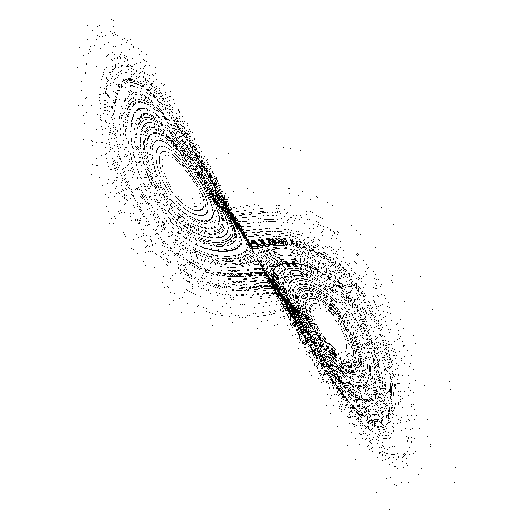
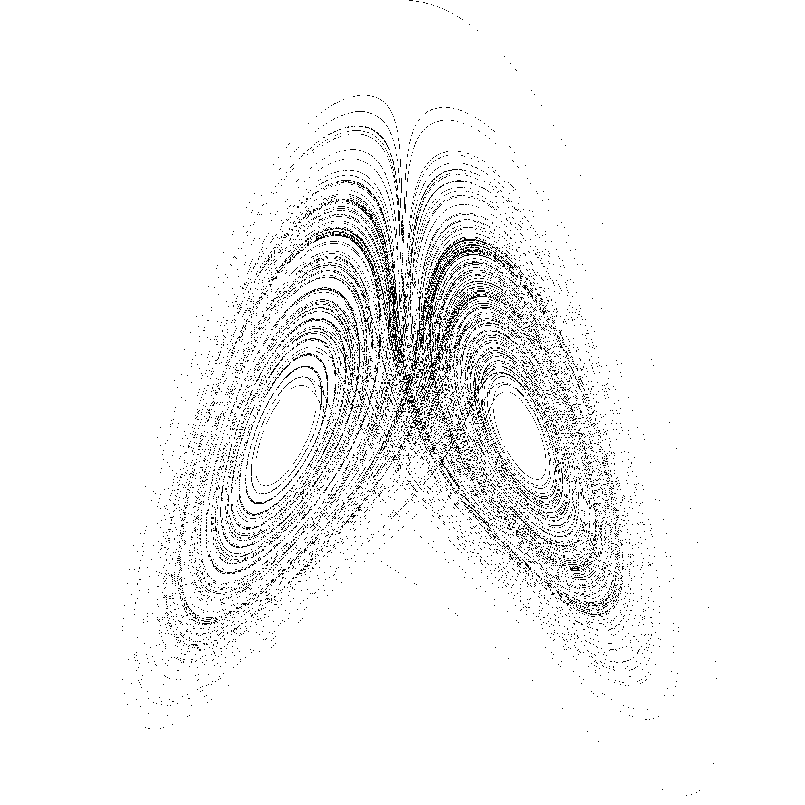

# Lorenz System

A [Lorenz System/Attractor](https://en.wikipedia.org/wiki/Lorenz_system) written in C# .Net using a histogram.

Variable settings:

	a, b, c
	time step
	iterations
	x, y, z (starting point)
	width, height

A release is available: a console app that processes and saves an image with hardcoded parameters. To change these parameters, you have to rebuild the code yourself.
	

# Renders

# Donate (click the image)

